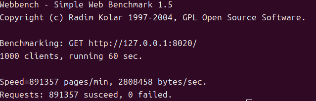

# MyMuduo
1. 仿照陈硕大神的muduo，完成了网络库的主要模块和基本功能，使用C++11重写，去除了对boost的依赖。
2. 在网络库的基础上添加HttpServer类，实现了基本的Web服务。并利用webbench进行压力测试。


# 运行
编译Mymuduo网络库
```
sudo ./build.sh
```
编译HttpServer
```
cd httpServer
mkdir build
cd build
cmake .. && make
```
HttpServerTest实现一个基本的webserver
```
cd httpServer
sudo make
```

# 压测结果
**测试环境：**  
unbuntu 24.04  
cpu: Intel i5-8300H(×8)  
memory: 16GB  
关闭所有LOG打印  
  
**只有一个mainLoop**  
HTTP短链接QPS：  11183  


**一个mainLoop+一个workLoop**  
HTTP短链接QPS：  14856  


**继续添加workLoop数量时，出现CPU占用率跑满，实验待改进** 
